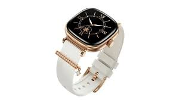
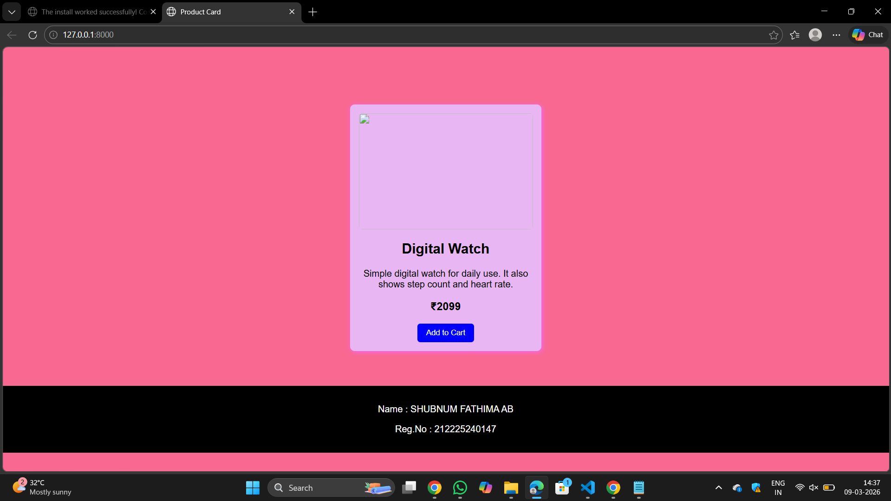

# Product Card Design with Hover Effect using CSS
## Date:9/3/2026

## AIM:
To design a Product Card for an E-commerce website using HTML and CSS and apply hover effects, transitions, and styling techniques to create an interactive user interface.

## DESIGN STEPS:

### Step 1:
Create a basic HTML structure using ```<!DOCTYPE html>, <html>, <head>, and <body>```.

### Step 2:
Add a container div for the product card.

### Step 3:
Insert the product image using the `````` tag.

### Step 4:
Add product name, description, and price using ```<h3>``` and ```<p>``` tags.

### Step 5:
Create an Add to Cart button using the ```<button>``` tag.

### Step 6:
Style the product card using CSS by applying:
<ul>
  <li>width</li>
  <li>padding</li>
  <li>border-radius</li>
  <li>box-shadow</li>
</ul>

### Step 7:
Align the card content using text-align and spacing properties.

### Step 8:
Add hover effects using :hover selector.

### Step 9:
Apply transform: translateY() to move the card slightly upward on hover.

### Step 10:
Increase the box-shadow to create a lifting effect.

### Step 11:
Add transform: scale() to slightly zoom the product image on hover.

### Step 12:
Apply transition property to make the hover animation smooth.

### Step 13:
Create a footer section at the bottom of the page.

### Step 14:
Display Learner Name and Register Number inside the footer.

### Step 15:
Style the footer using background color and center alignment.

### Step 10:
Test your webpage in a browser.

## PROGRAM:
```
<html>
<head>
<title>Product Card</title>

<style>

body{
background-color: rgb(249,104,145);
font-family: Arial;
text-align:center;
margin:0;
}

.box{
width:300px;
background:rgb(232,182,243);
margin:auto;
margin-top:100px;
padding:15px;
border-radius:8px;
box-shadow:2px 2px 8px rgb(242,104,249);
transition:0.3s;
}

.box:hover{
transform: translateY(-10px);
box-shadow:4px 6px 15px gray;
}

img{
width:100%;
height:200px;
object-fit:cover;
border-radius:6px;
transition:0.3s;
}

.box:hover img{
transform:scale(1.05);
}

button{
padding:8px 15px;
background-color:blue;
color:white;
border:none;
border-radius:5px;
cursor:pointer;
transition:0.3s;
}

button:hover{
background-color:navy;
}

footer{
background:black;
color:white;
text-align:center;
padding:15px;
margin-top:60px;
}

</style>

</head>

<body>

<div class="box">



<h2>Digital Watch</h2>

<p>Simple digital watch for daily use. It also shows step count and heart rate.</p>

<h3>₹2099</h3>

<button>Add to Cart</button>

</div>

<footer>

<p>Name : SHUBNUM FATHIMA AB</p>
<p>Reg.No : 212225240147</p>

</footer>

</body>
</html>


views.py
from django.shortcuts import render

def home(request):
    return render(request, 'card.html')


urls.py
from django.urls import path
from . import views

urlpatterns = [
    path('', views.home),
]
```
## OUTPUT:

## RESULT:
The Product Card with Hover Effect was successfully designed using HTML and CSS.
